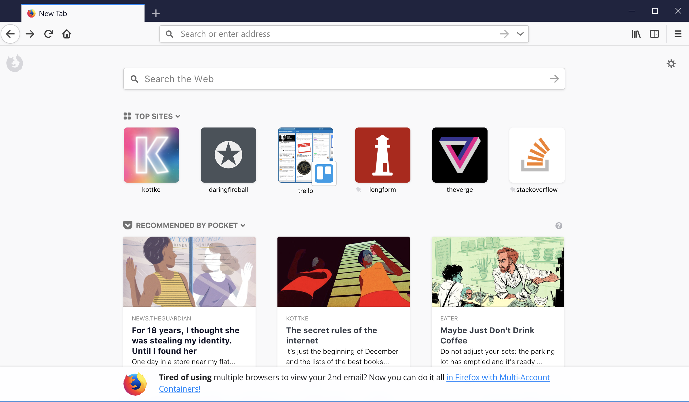

# Snippets

The snippets template shows up fixed to the bottom of the New Tab Page.



## Fields

### title

```
title : string (plain text)
```

A bold title displayed before the body `text`.

### text

```
text : string (rich text)
```

Main body text of snippet. This is a `Rich Text Field`, meaning a subset of HTML (i, b, u, strong, em, br) and links (defined via the `links` property)  are allowed.

### icon

```
icon : string (url)
```

Snippet icon. 64x64px. SVG or PNG preferred.


TODO: finish

